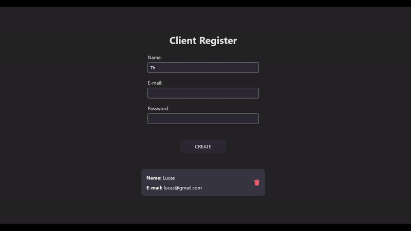

# Client Register

**Client Register** é uma aplicação web fullstack desenvolvida para gerenciar o registro de usuários em um banco de dados. A aplicação permite, além do cadastro de novos usuários, a exclusão de registros existentes. Além disso, conta com um sistema de criptografia de senhas para assegurar a proteção dos dados.



## Tecnologias

As principais tecnologias utilizadas no projeto são:

- Linguagem: TypeScript
- Banco de dados: PostgreSQL
- Gerenciador de pacotes: Pnpm
- Bibliotecas: React, axios, fastify, react-icons, react-toastify, bcrypt, pg
- Ferramentas: Vite, Git, ESlint, Prettier

## Instruções de uso

#### Clonar o repositório

Utilize os comandos a baixo para clonar o projeto e instalar as dependências.
**Nota**: Recomenda-se o uso de `pnpm`. Caso ele não esteja instalado, é possível utilizar `npm` como alternativa.

```
https://github.com/lucasroqe/client-register.git
cd frontend
pnpm i
cd backend
pnpm i
```

#### Configurar o banco de dados

A aplicação utiliza o SGBD PostgreSQL. Crie um BD de nome `register-db`. No arquivo `src/database/createTable.ts` estão as intruções SQL para criar a tabela.
Para submeter as instruções SQL, dentro da pasta `backend` execute o comando:

```
pnpm run create
```

A aplicação utiliza a porta `3333`, mas sinta-se a vontade para alterar dentro `server.ts`

#### Inicializar a aplicação

Inicialize a aplicação executando o seguinte comando em cada terminal para as pastas `backend` e `frontend`.

```
pnpm run start
```
